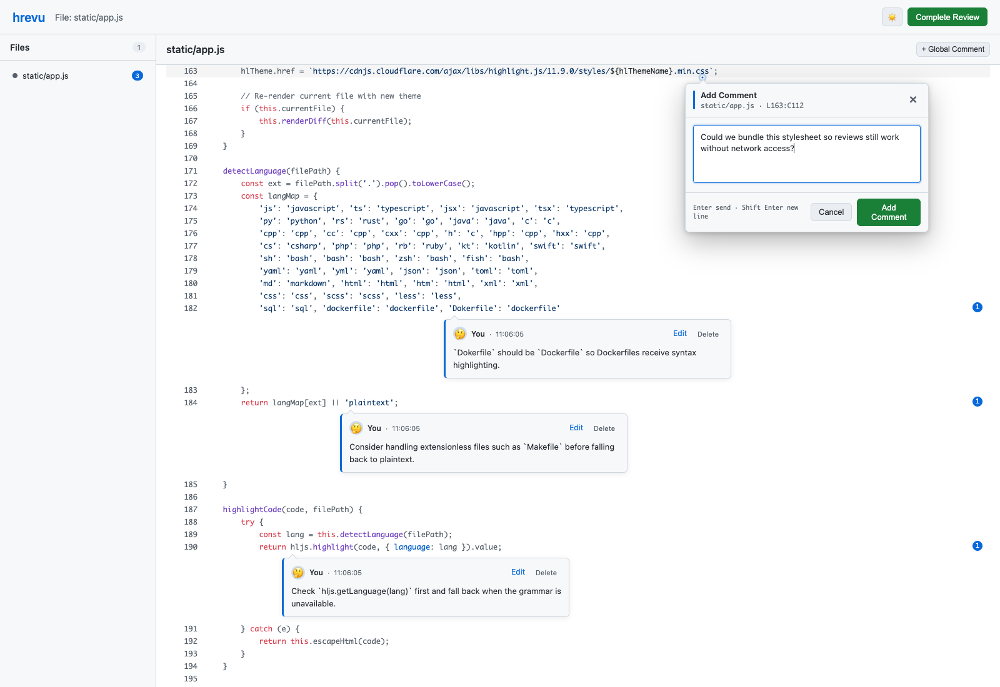

# /human-review for AI

[中文文档](README.zh-CN.md) | English

A CLI tool for manual code review with a web-based interface. Designed for AI coding workflows (Claude, Gemini, etc.), providing a browser-based review experience without cramped terminal input boxes.

## Quick Start

```bash
# Install CLI tool
cargo install human-review

# Install Claude Code skill
npx skills add alingse/human-review
```

## Usage

Use `/human-review` in your AI coding assistant:

```
/human-review diff              # Review current changes
/human-review README.md         # Review a specific file
/human-review abc1234           # Review a commit
/human-review last commit       # Review the last commit
/human-review current plan      # Review a plan document
```

Or use natural language - your AI will understand:
- `/human-review "Review the changes I just made"`
- `/human-review "Check the authentication module"`
- `/human-review "I want to review the last 3 commits"`

## Browser Review

Click an exact code position, add an inline comment, then select **Complete Review** to return the feedback to your AI assistant.



## Features

- **Browser-based review** - Light-first web interface with optional dark mode
- **Line-and-column commenting** - Anchor precise feedback to the exact code position
- **Multiple input modes** - Review commits, diffs, or any file
- **AI workflow integration** - Structured review context for applying actionable feedback
- **Bilingual** - Auto-detects Chinese/English based on browser locale

## License

MIT
